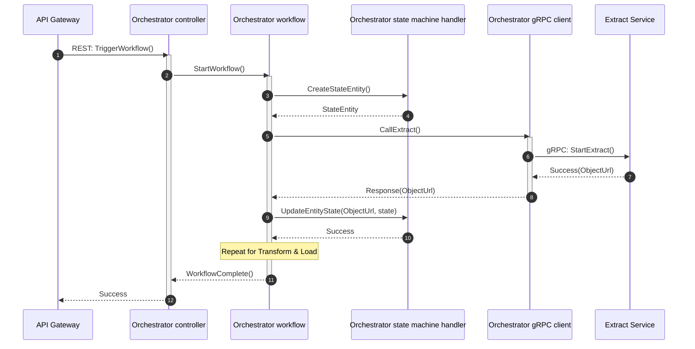

# Orchestrator
Orchestrator for an ETL project
## Functionality to implement
- Entry point of the orchestrator to trigger the workflow
- State machine for "jobs" to pass to ETL
- gRPC client manager
- Error handling / retries
## Questions to answer
- What is passed to the orchestrator to trigger the ETL? (file, data, any other info?)
- Will there be container scaling for the ETL containers? If so how do I know which to call?
- Do I have to handle load balancing or will that be the kubernetes job?
- For errors that occur, do they need to be logged? Do I have to plan for manual intervention (like manually retrying a failed job)
- Can we assume the same logic of the ETL no matter the input?
- How is the clean up of the ETL buckets handled? Does the orchestrator call the ETL for said clean up?
- Will there be caching for the orchestrator? If so would it be only for the entry point?
## Architecture diagram
### Sequence diagram

